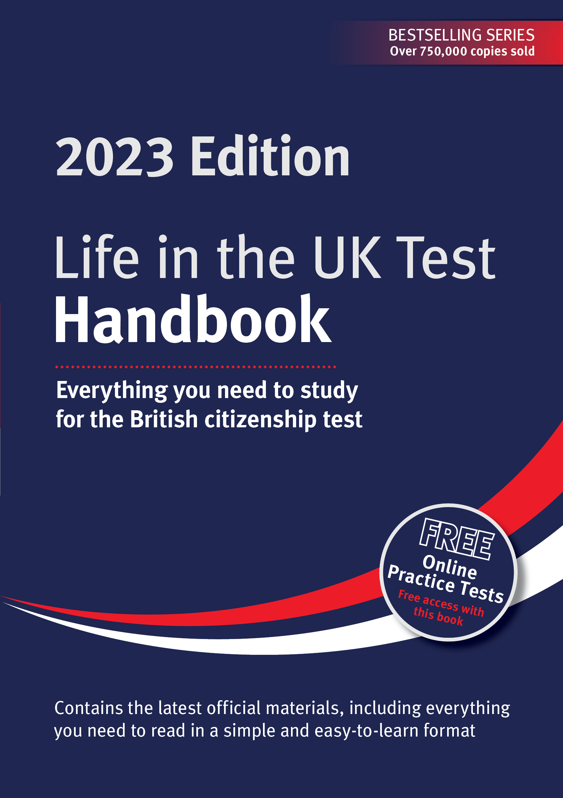

= Life in the UK Test: Study Notes
:author: Alexandry Augustin
:front-cover-image: 
// :data-uri:
:version-label: Edition
:revnumber: 2023
:toc: left
// :revdate: 2023
// :sectnums:
:description: Everything you need to study for the British citizenship test 2023
:keywords: test citizenship uk

include::./sections/the_values_and_principles_of_the_uk.adoc[leveloffset=+1]

include::./sections/what_is_the_uk.adoc[leveloffset=+1]

include::./sections/a_long_and_illustrious_history.adoc[leveloffset=+1]

include::./sections/a_modern_thriving_society.adoc[leveloffset=+1]

include::./sections/uk_government_the_law_and_your_role.adoc[leveloffset=+1]

include::./sections/appendices/index.adoc[leveloffset=+1]